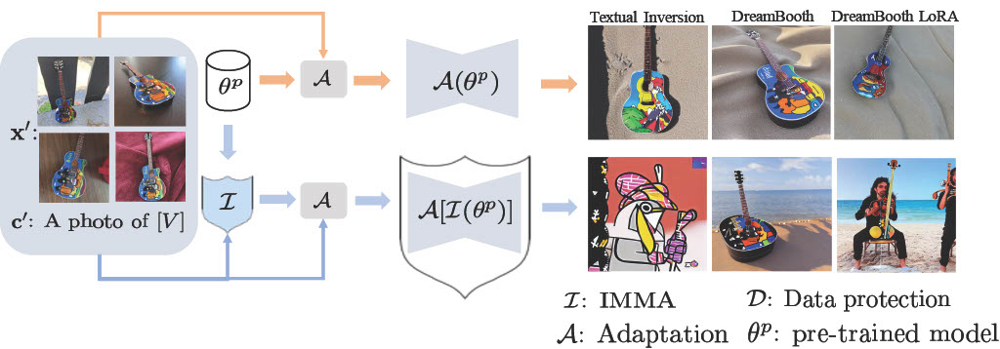

# IMMA: Immunizing text-to-image Models against Malicious Adaptation

This repository contains code for the submission "IMMA: Immunizing text-to-image Models against Malicious Adaptation".

## Overview

<p align="center">
  
</p>

IMMA takes in pre-trained model weights, images and corresponding prompts for training. The output if IMMA is immunized model weights. **After IMMA training**, the immunized model functions as the new pre-trained model for the further fine-tuning adaptation.

## Get Started

```{bash}
git clone git@github.com:zhengyjzoe/IMMA.git
conda env create -f environment.yaml
conda activate imma

export MODEL_NAME="CompVis/stable-diffusion-v1-4"
```

We implemented IMMA to immunize [CompVis/stable-diffusion-v1-4](https://huggingface.co/CompVis/stable-diffusion-v1-4) model from learning certain concepts after adaptation of fine-tuning methods. Our code was developed on top of the [example code](https://github.com/huggingface/diffusers/tree/main/examples) from [Diffusers](https://huggingface.co/docs/diffusers/index).


## Training and Evaluation Guide

### Immunizing erased models against re-learning

The training data for immunizing concept relearning is generated by [CompVis/stable-diffusion-v1-4](https://huggingface.co/CompVis/stable-diffusion-v1-4) with the prompt *"Image of \<concept\>"* or *"An artwork by \<artist\>"*. Note that you need a `metadata.csv` file that includes image file names and corrersponding prompts in the same folder of training images. We provide an example metadata file in `assets/metadata.csv`.

The erased model weights are trained with ESD [codebase](https://github.com/rohitgandikota/erasing) by modifying the cross-attention weights.

```{bash}
# Generate training images
python eval/text2image.py --prompt 'An artwork by Van Gogh' --num_images 100 --output_dir 'data/vangogh'


# Prepare ersed model weights (Only for illustration purpose. You may need to train your own erased model weights based on your target concept.)
wget https://erasing.baulab.info/weights/esd_models/art/diffusers-VanGogh-ESDx1-UNET.pt

# Train IMMA weights
export OUTPUT_DIR="results/relearning"
export TRAIN_DATA_DIR="data/vangogh"
export DELTA_CKPT="diffusers-VanGogh-ESDx1-UNET.pt"
accelerate launch train/defend_text_to_image_lora.py \
  --mixed_precision="no" \
  --pretrained_model_name_or_path=$MODEL_NAME \
  --train_data_dir=$TRAIN_DATA_DIR \
  --caption_column="prompt" \
  --resolution=512 --random_flip \
  --train_batch_size=1 \
  --num_train_epochs=50 \
  --learning_rate_lora=1e-04 \
  --learning_rate=1e-05 --lr_scheduler="constant" --lr_warmup_steps=0 \
  --seed=42 \
  --output_dir=$OUTPUT_DIR \
  --delta_ckpt=$DELTA_CKPT \
  --report_to="tensorboard" \
  --max_train_samples 20 \
  --inner_loop_steps=1 \
  --outer_loop_steps=1 

# Adapt LoRA on model immunized by IMMA
export IMMA_CKPT="${OUTPUT_DIR}/imma_unet_xatten_layer.pt"
export VALIDATION_PROMPT="An artwork by Van Gogh"
accelerate launch train/train_text_to_image_lora.py \
  --mixed_precision="fp16" \
  --pretrained_model_name_or_path=$MODEL_NAME \
  --train_data_dir=$TRAIN_DATA_DIR \
  --caption_column="prompt" \
  --resolution=512 --random_flip \
  --train_batch_size=1 \
  --num_train_epochs=50 \
  --learning_rate=1e-04 --lr_scheduler="constant" --lr_warmup_steps=0 \
  --seed=42 \
  --output_dir=$OUTPUT_DIR \
  --validation_prompt="${VALIDATION_PROMPT}" --report_to="tensorboard" \
  --validation_epochs 1 \
  --max_train_samples 20 \
  --delta_ckpt=$DELTA_CKPT \
  --imma_ckpt=$IMMA_CKPT 
```

###  Immunizing against personalized content

The datasets used for personalization adaptation in the paper are from [CustomConcept 101](https://github.com/adobe-research/custom-diffusion/tree/main/customconcept101). 

```{bash}
# Prepare datasets
wget https://www.cs.cmu.edu/~custom-diffusion/assets/data.zip
unzip data.zip

# Train IMMA weights agaisnt DreamBooth
export OUTPUT_DIR='results/dreambooth'
export INSTANCE_PROMPT="a photo of *s purse"
export INSTANCE_DIR="data/luggage_purse1"
accelerate launch train/defend_dreambooth.py \
  --pretrained_model_name_or_path=$MODEL_NAME  \
  --instance_data_dir=$INSTANCE_DIR \
  --output_dir=$OUTPUT_DIR \
  --instance_prompt="${INSTANCE_PROMPT}" \
  --resolution=512 \
  --train_batch_size=1 \
  --gradient_accumulation_steps=1 \
  --learning_rate=5e-6 \
  --learning_rate_defense=2e-5 \
  --report_to="tensorboard" \
  --lr_scheduler="constant" \
  --lr_warmup_steps=0 \
  --max_train_steps=1000 \
  --seed="0" \
  --inner_loop_steps=1 \
  --outer_loop_steps=1 \


# Adapt DreamBooth on model immunized by IMMA
export INSTANCE_PROMPT="A photo of a &m purse"
export VALIDATION_PROMPT="A &m purse on the beach"
export IMMA_CKPT="${OUTPUT_DIR}/imma_unet_xatten_layer.pt"
accelerate launch train/train_dreambooth.py \
  --pretrained_model_name_or_path=$MODEL_NAME  \
  --instance_data_dir=$INSTANCE_DIR \
  --output_dir=$OUTPUT_DIR_FT \
  --instance_prompt="${INSTANCE_PROMPT}" \
  --resolution=512 \
  --train_batch_size=1 \
  --gradient_accumulation_steps=1 \
  --learning_rate=5e-6 \
  --report_to="tensorboard" \
  --lr_scheduler="constant" \
  --lr_warmup_steps=0 \
  --max_train_steps=500 \
  --validation_prompt="${VALIDATION_PROMPT}" \
  --validation_steps=1 \
  --seed="0" \
  --num_validation_images=4 \
  --imma_ckpt=$IMMA_CKPT
```


### Evaluate IMMA

To evaluate IMMA's effect, we compute CLIP, DINO and LPIPS for the inference images.

```
python eval/eval.py --reference_dir [reference image dir] --base_dir [generation w/o IMMA dir] --imma_dir [generation w/ IMMA dir] --save_dir [csv save dir] --metric [choose from clip, dino and lpips]
```

## License

Copyright The Paper Authors. All Rights Reserved. You may not modify, distribute, or use this software for any purpose beyond the review process.

The repository builds on top of HuggingFace examples, please refer to their license within the code.

